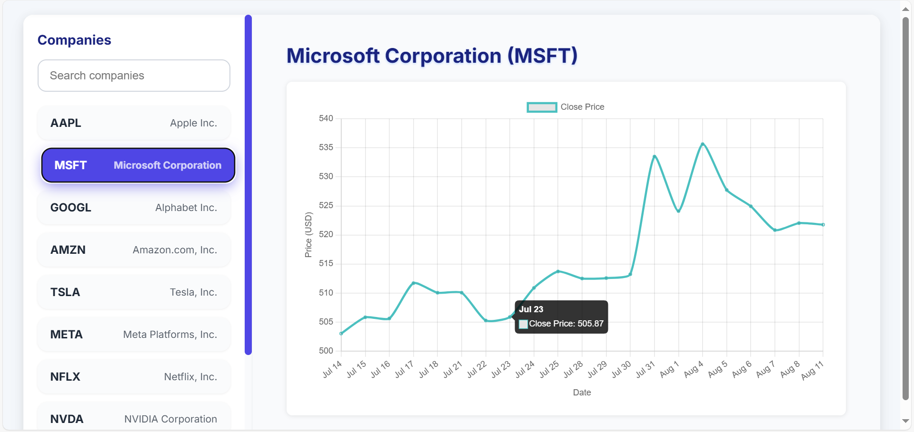
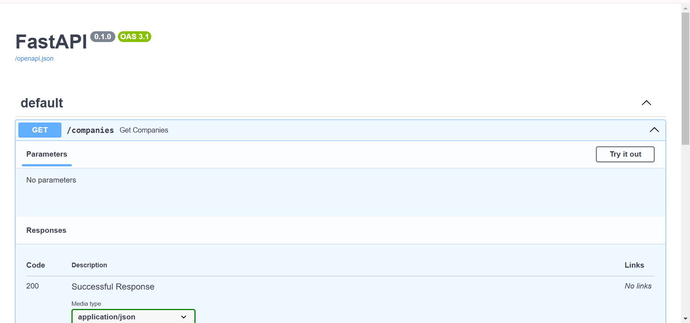

---

# Stock Market Dashboard Web Application

[](https://opensource.org/licenses/MIT)

---

## Overview

This project is a **Stock Market Dashboard** web application that displays historical stock price data for multiple companies in a clean, responsive interface. It features a scrollable company list, detailed interactive charts, and key stock statistics.

Built as part of the JarNox Full Stack Developer assignment, this app demonstrates my ability to integrate frontend, backend, and data handling in a real-world financial context.

---

## Features

* **Responsive UI** with two panels:

  * Left panel: Scrollable list of 10+ companies with search functionality.
  * Main panel: Dynamic chart area displaying historical stock prices for the selected company.
* **Backend API** built with FastAPI:

  * Serves company metadata and historical stock data.
  * Connects to an SQLite database seeded with historical price data.
* **Frontend** built with React and Chart.js:

  * Clean and modern UI design.
  * Interactive line charts visualizing stock close prices over time.
* **Additional stock stats** such as 52-week high, 52-week low, and average volume.
* **Error handling and loading states** to improve user experience.

---

## Technologies Used

* **Backend:** Python, FastAPI, SQLAlchemy, SQLite
* **Frontend:** React, Vite, Axios, Chart.js
* **Data:** Yahoo Finance (yfinance) for seeding historical data (also supports CSV dataset)
* **Development Tools:** VSCode, Postman, Git

---

## Project Structure

```
backend/
├── app/
│   ├── main.py           # FastAPI app with endpoints
│   ├── models.py         # SQLAlchemy ORM models
│   ├── schemas.py        # Pydantic schemas for API validation
│   ├── seed_data.py      # Script to seed database with stock data
│   └── db.py             # Database connection and session
frontend/
├── src/
│   ├── App.jsx           # Main React app component
│   ├── components/       # CompanyList, ChartArea components
│   ├── index.jsx         # React entry point
│   └── styles.css        # Custom CSS styles
README.md                 # Project documentation (this file)
```

---

## Setup Instructions

### Backend

1. Create and activate a virtual environment:

   ```bash
   python -m venv venv
   source venv/bin/activate   # Linux/macOS
   venv\Scripts\activate      # Windows
   ```
2. Install dependencies:

   ```bash
   pip install -r requirements.txt
   ```
3. Seed the database with stock data:

   ```bash
   python -m app.seed_data
   ```
4. Run the backend API server:

   ```bash
   uvicorn app.main:app --reload
   ```

### Frontend

1. Navigate to the frontend directory:

   ```bash
   cd frontend
   ```
2. Install dependencies:

   ```bash
   npm install
   ```
3. Start the React development server:

   ```bash
   npm run dev
   ```
4. Open `http://localhost:3000` in your browser.

---

## Usage

* Use the search box on the left to filter companies.
* Click a company to load its historical stock data.
* View interactive charts and key stats on the right panel.

---

## Challenges & Learnings

* Handling asynchronous data loading and state management in React.
* Integrating FastAPI backend with a React frontend.
* Managing database seeding using `yfinance` and dealing with data type deprecations.
* Designing a clean, user-friendly UI with responsive layouts and meaningful interactivity.
* Understanding stock market data and visualizing time-series effectively.

---

## Future Improvements

* Add AI/ML-based price prediction for stocks.
* Implement additional technical indicators like RSI, MACD.
* Deploy the full application on cloud platforms like Vercel and Railway.
* Dockerize backend and frontend for easier deployment.
* Enhance UI/UX with advanced chart interactions and themes.

---

## Screenshots / Demo




## Contact

**Author:** Rohit Bansal
**Email:** bansalrohit282@gmail.com
**GitHub:** https://github.com/ROHITBANSAL65

---

*Thank you for reviewing my project! I look forward to the opportunity to discuss this further.*


